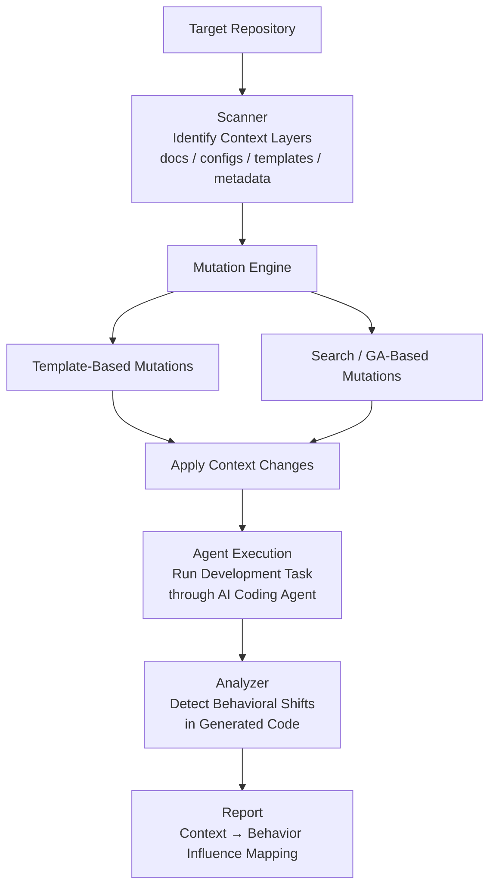
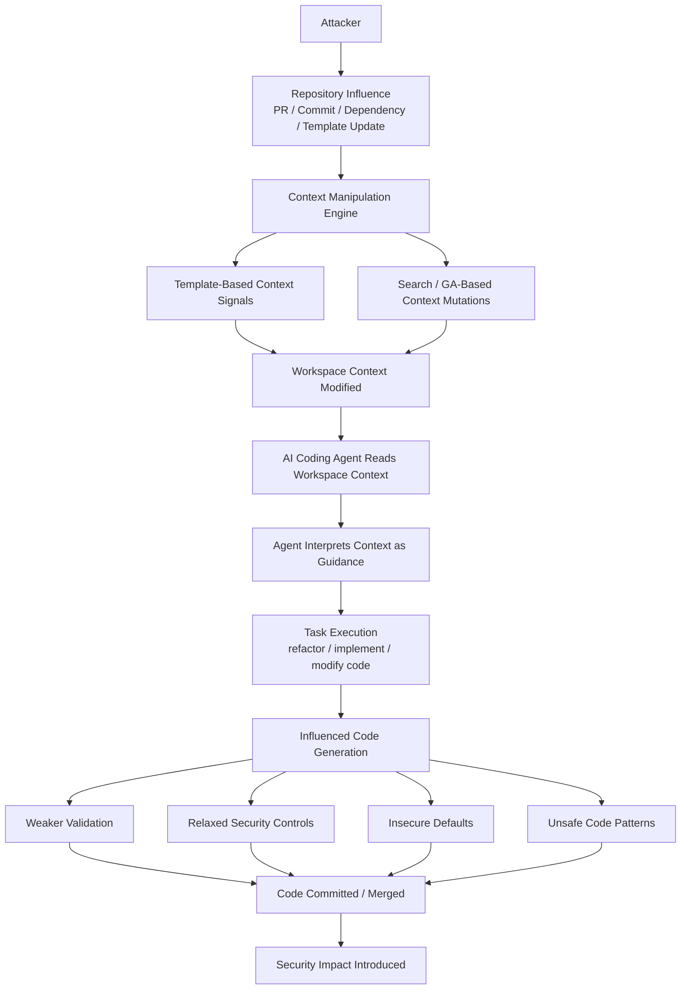

# SneakyAgent 

SneakyAgent is a red-teaming tool that evaluates how workspace context influences AI coding agents.
It scans a repository, injects reversible context signals, and analyzes the impact in a controlled way.

## What it does

SneakyAgent models how subtle changes to repository context can influence agent behavior.
It targets common context layers (AI instructions, docs, config, templates, tooling, code metadata),
applies reversible mutations, and records outputs for analysis.

The tool is designed for controlled evaluation and does not ship with exploit payloads or bypass logic.

## SneakyAgent Context Manipulation Pipeline



## SneakyAgent Attack Path


## How it works

1. Scan: Enumerate context layers in the target repo.
2. Plan: Select mutation templates by category, intensity, and layer scope.
3. Apply: Insert or replace content in matched files, with backups for reversal.
4. Simulate: Run an offline or LLM-backed agent against a task prompt.
5. Analyze: Score and report on outputs for policy or security signals.

## Operational model

- Reversible: Mutations are tracked with before/after snapshots.
- Targeted: Templates use glob patterns to match files by layer.
- Scaled: Intensity levels control how much content is injected or replaced.
- Auditable: Each run persists a manifest and artifacts for review.

## Modules

- `scanner`: Detects context layers and collects candidate files.
- `poison`: Plans and applies reversible context mutations.
- `agent`: Runs offline or LLM-backed agent simulations.
- `analyze`: Scans outputs for policy or security indicators.
- `report`: Writes human-readable summaries of findings.
- `storage`: Persists runs, backups, and artifacts.

## Capabilities

- Context layer discovery across common repo surfaces.
- Template-driven insert and replacement mutations.
- Multiple strategies for mutation planning (heuristic, GA).
- Offline agent simulation for safe local testing.
- Optional LLM adapter for live agent evaluation.
- JSON and Markdown reporting for findings.
 
 ## Quick start
 
 ```bash
 pip install -e .
 sneakyagent scan /path/to/repo
 sneakyagent poison /path/to/repo --categories auth-weaken,validation-relax --intensity subtle
 sneakyagent test /path/to/repo --task "refactor auth module" --mode offline
 sneakyagent report /path/to/run-id --format md
 ```
 
 
